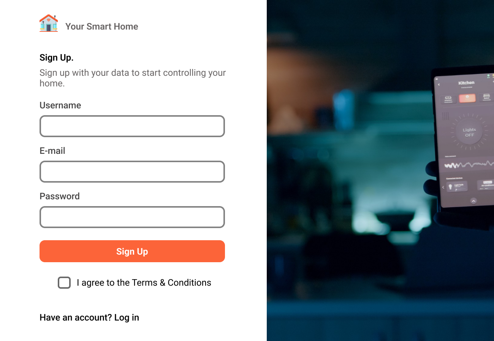

# Registration System
  &nbsp;&nbsp;&nbsp;&nbsp; JavaFX with MySQL database integration

  &nbsp;&nbsp;&nbsp;&nbsp; Stepping through GitHub's project planner

## What did I learn so far?
- Creating and Connecting to MySQL (or RDBMS) servers via JDBC
- Connection between FXML and Objects
- Advanced Exception handling including 
- Regular expressions patterns
- Changing scenes in single stage
- Controlling scenes using controller classes
- Validate results from Database using ResultSet and Statement interfaces
- Experience the UI as normal user, not developer.
- Much more...

## Initial(Expected) Design:
**Login Screen**

**Sign Up Screen**
